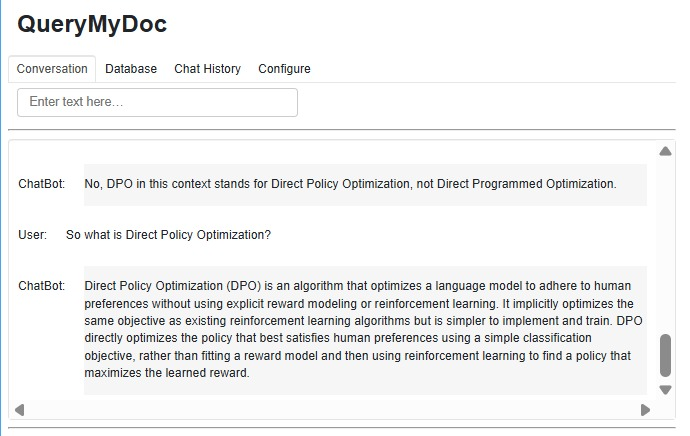
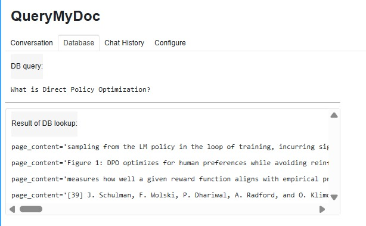
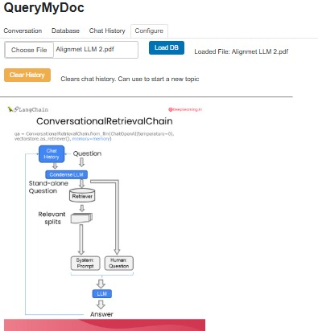

# langchain-rag-chatbot
*A conversational Retrieval-Augmented Generation chatbot built with LangChain, OpenAI, Panel, and Param.*

## QueryMyDoc, PDF-Powered RAG Chatbot
QueryMyDoc is an interactive chatbot that lets you chat with your own PDF documents.
Upload any PDF (lecture notes, research papers, manuals, reports), and the bot will instantly build a searchable knowledge base using Retrieval-Augmented Generation (RAG).
Ask questions conversationally, and it will generate grounded, citation-based responses.

## Features

*  Upload any PDF and instantly build a vector database
* Semantic search using OpenAI embeddings
*  Conversational AI using LangChain’s `ConversationalRetrievalChain`
* Retrieval-Augmented Generation (RAG) for accurate, grounded answers
* Chat history tracking
* View retrieved chunks (sources)
* Interactive UI dashboard built with Panel
*  Automatically updates when new PDFs are loaded

---

## What is RAG (Retrieval-Augmented Generation)?

RAG is an LLM technique that improves answer accuracy by grounding responses in external knowledge.
Instead of relying only on the model’s internal memory, RAG:

1. Chunks your documents (PDF pages → small overlapping text blocks)
2. Generates embeddings for each chunk (vector representations of meaning)
3. Stores them in a vector database
4. Runs similarity search when you ask a question
5. Retrieves the top-k most relevant chunks
6. Feeds those chunks into the LLM
7. The LLM generates an answer based only on retrieved knowledge, not imagination

This prevents hallucinations and ensures the chatbot answers using your actual document, not general world knowledge.

## Tech Stack

### LangChain

Used for:

* PDF loading (`PyPDFLoader`)
* Chunking (`RecursiveCharacterTextSplitter`)
* Embeddings (`OpenAIEmbeddings`)
* Vector store (`DocArrayInMemorySearch`)
* Conversational RAG chain (`ConversationalRetrievalChain`)

### OpenAI

Used for:

* GPT model that generates answers
* Embedding model to encode document chunks

###  Panel

Provides the web-based dashboard:

* Input box
* Buttons (load file, clear history)
* Tabs (Conversation, Database View, Chat History, Configure)

### Param

Handles reactive state variables:

* chat history
* generated question
* retrieved documents
* last answer

These automatically update UI components in Panel.

### Conversation Tab

### Database View

### Configuration Tab

